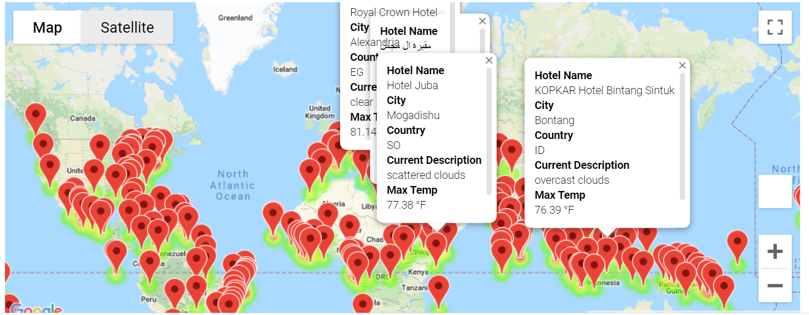
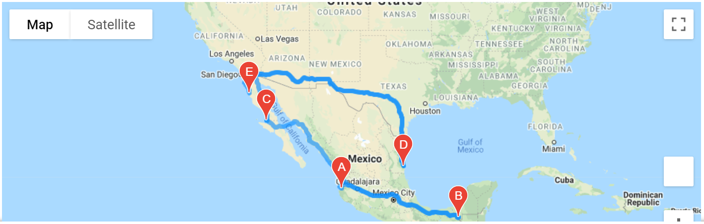

# World_Weather_Analysis

## Overview 
PlanMyTrip is a top travel technology company that specializes in internet related services in the hotel and lodging industry. 
The purpose of this project was to build on the existing Weather/Vacation app that allowed users to search the weather data at suggested vacation spots based on the temperature inputs from the user. 

## Resources
- Data source:
  WeatherPy_Database.csv
  WeatherPy_Vacation.csv
- Software:
  Python 3.6.1
  Jupyter Notebook
  Pandas,Citipy, Scipy, requests,gmaps, and numpy library and dependencies
  OpenWeather and Google Maps APIs
  
## Improvement Process
The following steps are the updates that we need to improve the app:
- Adding the weather description to the weather data that retrieved this module.
- Have the beta testers use input statements to filter the data for their weather preference, which will be used to identify potential travel destinations and nearby hotels.
- From the list of potential travel destinations, the beta tester will choose 4 cities to create a travel itineary.
- Using the Google Maps Directions API, I will create a travel route between the 4 cities and a marker layer map.

## Result
A map was created to display City name, Country, Weather Description, and Max Temperature. The customers can add their temperature prefereces which can filter the cities that meet the requirement. We can find the nearest hotel using Google Maps API based on the filtered cities as a recommendation.

Our customers can decide a trip itinerary per 4 recommended cities.

